# 🤖 Project JARVIS — Discovery Document

**Project:** Autonomous Coding Agent Desktop Application
**Codename:** JARVIS
**Author:** Bjorn Vandegaer
**Date:** 2 February 2026
**Version:** 1.0 — Discovery Phase

---

## 1. Vision & Summary

JARVIS is a Windows desktop application with an Iron Man / Jarvis-inspired UI that orchestrates autonomous AI coding agents. It uses Claude Code (via OAuth token from a Claude Max subscription) to plan, implement, test, and deliver software features — running multiple agents in parallel across feature groups.

The application combines three proven patterns:
- **Anthropic's Two-Agent Pattern** (initializer + coding agent)
- **Ralph Loop** (autonomous iteration until PRD items are complete)
- **Swarm-style Orchestration** (parallel multi-agent management with handoffs)

**Key differentiator:** A visual, non-terminal interface that makes autonomous coding accessible and manageable — with feature group ordering, approval gates, environment scanning, and auto-generated documentation.

---

## 2. Consolidated Requirements

### 2.1 Platform & Stack

| # | Question | Answer |
|---|----------|--------|
| 1 | Platform target | **Windows desktop executable** (no terminal, forms-style app) |
| 2 | Programming language | **TBD** — Python, TypeScript, or hybrid. To be recommended |
| 3 | Target OS | **Windows only** |

### 2.2 Auth & Subscription

| # | Question | Answer |
|---|----------|--------|
| 4 | Claude subscription | **Claude Max** — uses `CLAUDE_CODE_OAUTH_TOKEN` (not API key) |
| 5 | GitHub accounts | **Multiple accounts** needed (personal + business/school) |

### 2.3 Agent Architecture

| # | Question | Answer |
|---|----------|--------|
| 6 | Parallel execution | Multiple agents on **different features of the same project** simultaneously (not separate projects) |
| 7 | Agent types | Yes — beyond initializer/coder: **QA agent**, **prompt enhancement agent**, and potentially more |
| 8 | Project types | **All types** — web apps, Python, C#, PHP, etc. Must be language/framework agnostic |

### 2.4 Project Management

| # | Question | Answer |
|---|----------|--------|
| 9 | Dashboard | Yes — **dashboard with progress tracking**, session history, feature status |
| 10 | Existing codebases | Yes — point to an **existing folder/repo** and work on it |
| 11 | PM tool integration | **Later phase** — Linear, Trello, Notion integration (not MVP) |

### 2.5 Memory & Skills

| # | Question | Answer |
|---|----------|--------|
| 12 | Skills/plugins | **Custom skills/plugins/hooks** integration — both user-defined and Claude Agent SDK built-in |
| 13 | Database | **SQLite** preferred — flexible. **Important:** Agent must detect existing installations (Node.js versions, Python versions, etc.) before installing anything — environment scanner first |
| 14 | Memory scope | **Project-specific memory** with optional **global memory** (cross-project preferences) |

### 2.6 UI/UX

| # | Question | Answer |
|---|----------|--------|
| 15 | Visual style | **Jarvis/Iron Man aesthetic** — dark theme, cyan/turquoise glowing accents, holographic elements, circular HUD elements, arc reactor motif (reference images provided) |
| 16 | Terminal output | **No live terminal output** — status updates/summaries in UI. Detailed **logs available on demand** |
| 17 | Chat interface | **Yes** — mid-session interaction via chat is wanted |

### 2.7 Workflow & Review

| # | Question | Answer |
|---|----------|--------|
| 18 | Documentation | Auto-generated **diagrams in project root**: ERD, use cases, class diagrams, API endpoints, installation guide, requirements. Possibly via **Figma integration**. Must be clear for both **IT professionals and non-technical users** |
| 19 | Approval & ordering | Default = **fully autonomous**. Per-feature approval configurable. **Feature group ordering** — drag & drop to reorder groups of related features (e.g., "build UI first, then login logic"). Not individual features but coherent groups |
| 20 | Distribution & notifications | **Personal use** initially. **Email reports** on progress. Possibility to **reply to emails** to interact with the system |

---

## 3. User Stories

### Epic 1: Project Setup & Management

```
US-1.1  As a user, I want to create a new project by specifying a name, 
        description, and tech stack so the system can scaffold it properly.

US-1.2  As a user, I want to add an existing codebase by pointing to a 
        local folder so agents can analyze and work on it.

US-1.3  As a user, I want to see a dashboard of all my projects with 
        progress indicators, last activity, and agent status.

US-1.4  As a user, I want to connect multiple GitHub accounts 
        (personal + business) so agents can push to the right repos.

US-1.5  As a user, I want the system to scan my environment (Node.js, 
        Python, PHP, .NET versions, installed tools) before any agent 
        starts working, to avoid conflicts and duplicate installations.
```

### Epic 2: Feature Planning & Ordering

```
US-2.1  As a user, I want to define features/requirements in a PRD format 
        (or import from a document) so agents know what to build.

US-2.2  As a user, I want a prompt enhancement agent to expand my vague 
        descriptions into detailed, actionable feature specs.

US-2.3  As a user, I want features automatically grouped into coherent 
        clusters (e.g., "UI Components", "Auth Logic", "API Endpoints") 
        that I can reorder via drag & drop.

US-2.4  As a user, I want to set the execution order of feature groups 
        so that foundational work (like UI layout) happens before 
        dependent work (like login integration).

US-2.5  As a user, I want to mark individual features as requiring 
        manual approval before the agent proceeds, while keeping 
        others fully autonomous.
```

### Epic 3: Agent Orchestration

```
US-3.1  As a user, I want the system to run multiple coding agents in 
        parallel on different features of the same project using 
        git worktrees for isolation.

US-3.2  As a user, I want a QA agent to automatically review and test 
        completed features before marking them as done.

US-3.3  As a user, I want agents to follow the Ralph loop pattern — 
        iterating autonomously until PRD items are objectively complete, 
        with fresh context on each iteration.

US-3.4  As a user, I want a resource manager that monitors CPU/RAM usage 
        and limits the number of parallel agents to prevent system overload.

US-3.5  As a user, I want agents to accumulate learnings in AGENTS.md 
        and guardrails.md files so future iterations are smarter.

US-3.6  As a user, I want circuit breakers and iteration limits to 
        prevent runaway loops (e.g., max 35 iterations per feature).
```

### Epic 4: Skills & Plugins

```
US-4.1  As a user, I want to add custom Claude skills/plugins that agents 
        can use during development (e.g., frontend design skill, 
        database normalization skill).

US-4.2  As a user, I want to configure hooks that run before/after agent 
        actions (e.g., linting, formatting, testing).

US-4.3  As a user, I want a skill marketplace or directory where I can 
        browse and install community skills.
```

### Epic 5: UI & Experience

```
US-5.1  As a user, I want a Jarvis/Iron Man themed interface with dark 
        background, cyan glowing accents, and holographic-style panels.

US-5.2  As a user, I want to see agent progress as summaries and status 
        updates (not raw terminal output) with detailed logs available 
        on demand.

US-5.3  As a user, I want a chat interface where I can interact with 
        agents mid-session to provide corrections or guidance.

US-5.4  As a user, I want real-time visual indicators showing which 
        agents are active, their current task, and resource usage.

US-5.5  As a user, I want a circular/radial HUD element showing overall 
        project progress (features done / total).
```

### Epic 6: Documentation Generation

```
US-6.1  As a user, I want the system to auto-generate documentation in 
        the project root: ERD diagrams, use case diagrams, class diagrams, 
        API endpoint docs, installation guides, and requirements.

US-6.2  As a user, I want documentation to be understandable by both 
        developers and non-technical stakeholders.

US-6.3  As a user, I want the option to export diagrams via Figma 
        integration or as SVG/PNG files.
```

### Epic 7: Notifications & Communication

```
US-7.1  As a user, I want email reports when agents complete features, 
        encounter errors, or need approval.

US-7.2  As a user, I want to reply to email reports to provide feedback 
        or approvals without opening the app.

US-7.3  As a user, I want configurable notification settings (which events 
        trigger emails, frequency, detail level).
```

### Epic 8: Configuration & Auth

```
US-8.1  As a user, I want to securely store my Claude OAuth token locally 
        so I don't have to re-enter it each session.

US-8.2  As a user, I want to manage multiple GitHub tokens/accounts with 
        labels (personal, business, school).

US-8.3  As a user, I want all configuration stored locally in SQLite 
        with encryption for sensitive data.

US-8.4  As a user, I want project-specific memory (patterns, preferences) 
        and optional global memory that carries across all projects.
```

---

## 4. Feature Groups & Priority

Features are organized into **groups** that can be reordered. Default execution order:

```
┌─────────────────────────────────────────────────┐
│  PRIORITY    FEATURE GROUP                      │
├─────────────────────────────────────────────────┤
│  ██████████  1. Core UI Shell & Navigation      │
│  █████████░  2. Project Management Dashboard    │
│  ████████░░  3. Environment Scanner             │
│  ███████░░░  4. Auth & Configuration Manager    │
│  ██████░░░░  5. PRD & Feature Planning Engine   │
│  █████░░░░░  6. Agent Orchestration Engine      │
│  ████░░░░░░  7. Ralph Loop Implementation       │
│  ███░░░░░░░  8. QA & Review Pipeline            │
│  ██░░░░░░░░  9. Documentation Generator         │
│  █░░░░░░░░░  10. Email Notifications & Replies  │
│  ░░░░░░░░░░  11. Skills & Plugin System         │
│  ░░░░░░░░░░  12. PM Tool Integration (Later)    │
└─────────────────────────────────────────────────┘

User can drag groups to reorder. E.g., move "Agent Orchestration" 
above "Auth" if preferred.
```

### Group Details

**Group 1: Core UI Shell & Navigation**
- Main window with Jarvis theme
- Navigation sidebar
- System tray integration
- Window management (minimize to tray)

**Group 2: Project Management Dashboard**
- Project list/cards view
- Progress indicators per project
- Session history timeline
- Add new / import existing project

**Group 3: Environment Scanner**
- Detect installed runtimes (Node.js, Python, .NET, PHP, Java, etc.)
- Detect package managers (npm, pip, composer, nuget, etc.)
- Detect git configuration
- Report missing dependencies before agent starts
- Suggest installations with user confirmation

**Group 4: Auth & Configuration Manager**
- Claude OAuth token storage (encrypted)
- GitHub multi-account management
- Email configuration for notifications
- Global preferences (default tech stack, coding style)
- SQLite database initialization

**Group 5: PRD & Feature Planning Engine**
- PRD creation wizard / import
- Prompt enhancement agent (vague → detailed specs)
- Feature extraction from PRD
- Auto-grouping of related features
- Drag & drop group reordering
- Per-feature approval toggle

**Group 6: Agent Orchestration Engine**
- Claude Agent SDK integration
- Parallel agent spawning via git worktrees
- Resource manager (CPU/RAM monitoring)
- Agent lifecycle management (spawn, monitor, terminate)
- Context variable passing between agents
- Triage agent for task routing

**Group 7: Ralph Loop Implementation**
- Ralph loop shell (iterate until complete)
- Progress tracking (progress.txt / prd.json)
- Guardrails system (accumulated failure learnings)
- AGENTS.md updates after each iteration
- Context rotation at 70k/80k token thresholds
- Circuit breaker (max iterations configurable)
- Stop hook with completion verification

**Group 8: QA & Review Pipeline**
- Automated QA agent (runs tests, checks types)
- Diff viewer for completed features
- Approval gates (configurable per feature)
- PR creation per feature/group
- Build verification step

**Group 9: Documentation Generator**
- ERD diagram generation
- Use case diagram generation
- Class diagram generation
- API endpoint documentation
- Installation guide generator
- Requirements document generator
- Export as SVG/PNG/Markdown
- Figma integration (optional)

**Group 10: Email Notifications & Replies**
- SMTP/email service configuration
- Progress report emails
- Error notification emails
- Approval request emails
- Reply-to-email processing
- Email templates (Jarvis-themed)

**Group 11: Skills & Plugin System**
- Custom skill registration
- Skill directory browser
- Hook system (pre/post agent actions)
- Skill parameter configuration
- Built-in Claude Agent SDK skills

**Group 12: PM Tool Integration (Future)**
- Linear integration
- Trello integration
- Notion integration
- Bidirectional sync (tasks ↔ features)

---

## 5. Architecture Overview

### 5.1 High-Level Architecture

```mermaid
graph TB
    subgraph UI["🖥️ Desktop UI (Electron/Tauri)"]
        DASH[Dashboard]
        CHAT[Chat Interface]
        LOGS[Log Viewer]
        CONF[Configuration]
        PLAN[Feature Planner]
    end

    subgraph CORE["⚙️ Core Engine"]
        ORCH[Orchestrator]
        RESC[Resource Manager]
        SCAN[Environment Scanner]
        NOTIFY[Notification Service]
        DOCS[Doc Generator]
    end

    subgraph AGENTS["🤖 Agent Layer"]
        INIT[Initializer Agent]
        CODE1[Coding Agent 1]
        CODE2[Coding Agent 2]
        CODE3[Coding Agent 3]
        QA[QA Agent]
        PROMPT[Prompt Enhancer]
    end

    subgraph STORAGE["💾 Storage Layer"]
        DB[(SQLite DB)]
        FS[File System]
        GIT[Git / Worktrees]
    end

    subgraph EXTERNAL["🌐 External Services"]
        CLAUDE[Claude Code / Agent SDK]
        GITHUB[GitHub API]
        EMAIL[Email Service]
        FIGMA[Figma API]
    end

    UI --> CORE
    CORE --> AGENTS
    CORE --> STORAGE
    AGENTS --> EXTERNAL
    NOTIFY --> EMAIL
    DOCS --> FIGMA
    ORCH --> GIT
```



### 5.2 Agent Orchestration Flow

```mermaid
sequenceDiagram
    participant U as User
    participant O as Orchestrator
    participant PE as Prompt Enhancer
    participant RM as Resource Manager
    participant I as Initializer Agent
    participant C1 as Coding Agent 1
    participant C2 as Coding Agent 2
    participant QA as QA Agent
    participant G as Git

    U->>O: Start project build
    O->>PE: Enhance PRD features
    PE-->>O: Detailed feature specs
    O->>O: Group features & set order
    U->>O: Approve/reorder groups

    loop For each Feature Group (in order)
        O->>RM: Can spawn agents?
        RM-->>O: CPU/RAM OK, proceed

        O->>G: Create worktree (feature-branch)
        O->>I: Initialize feature context
        I-->>O: Context ready

        par Parallel Agents
            O->>C1: Build Feature A
            O->>C2: Build Feature B
        end

        loop Ralph Loop (per feature)
            C1->>C1: Read PRD + progress
            C1->>C1: Implement next item
            C1->>C1: Update progress.txt
            C1->>C1: Update AGENTS.md
            alt Context > 70k tokens
                C1->>C1: Warn & prepare rotation
            end
            alt Context > 80k tokens
                C1->>O: Request fresh context
                O->>C1: Spawn fresh instance
            end
            alt All items complete
                C1->>O: COMPLETE signal
            end
        end

        O->>QA: Review completed features
        QA-->>O: Test results + feedback

        alt Approval required
            O->>U: Request approval
            U-->>O: Approved / changes needed
        end

        O->>G: Merge worktree → main
    end

    O->>U: Project complete! 🎉
```



### 5.3 Ralph Loop Detail


### 5.4 Feature Group Ordering Flow


---

## 6. Technology Stack Recommendation

### 6.1 Recommended Stack

| Layer | Technology | Justification |
|-------|-----------|---------------|
| **Desktop Framework** | **Electron** | Mature, proven for desktop apps (VS Code, Discord use it). Rich UI capabilities for Jarvis theme. Auto-Claude project uses it successfully. Large ecosystem. |
| **Frontend** | **React + TypeScript** | Ideal for complex interactive UIs. Great for drag & drop, real-time updates, HUD-style components. Tailwind CSS for styling. |
| **Backend** | **Python** | Claude Agent SDK has Python support. Ralph loop implementations are Python/Bash. Rich ecosystem for file handling, git operations, process management. |
| **IPC** | **Electron IPC + WebSocket** | For real-time communication between frontend and Python backend. WebSocket for live agent status updates. |
| **Database** | **SQLite** (via `better-sqlite3` or Python `sqlite3`) | Local, zero-config, file-based. Perfect for single-user desktop app. |
| **Agent SDK** | **Claude Agent SDK** (`@anthropic-ai/claude-agent-sdk`) | Official Anthropic SDK for programmatic Claude Code access. Supports OAuth tokens. |
| **Git** | **simple-git** (Node) + **gitpython** (Python) | Git worktree management, branch operations, PR creation. |
| **Email** | **nodemailer** or Python `smtplib` | SMTP email sending for reports. IMAP for reply processing. |
| **Packaging** | **electron-builder** | Creates `.exe` installer for Windows. Auto-update support. |

### 6.2 Alternative: Tauri

| Aspect | Electron | Tauri |
|--------|----------|-------|
| Bundle size | ~150MB | ~10MB |
| RAM usage | Higher (Chromium) | Lower (system webview) |
| Ecosystem | Massive | Growing |
| UI flexibility | Full (Chromium) | Depends on system webview |
| Maturity | Very mature | Stable but newer |
| Windows support | Excellent | Good |

**Recommendation:** Start with Electron for maximum UI flexibility (critical for Jarvis aesthetic). Consider Tauri for v2 if performance is a concern.

### 6.3 Project Structure

```
jarvis/
├── apps/
│   ├── desktop/                 # Electron app
│   │   ├── src/
│   │   │   ├── main/           # Electron main process
│   │   │   │   ├── index.ts
│   │   │   │   ├── ipc/        # IPC handlers
│   │   │   │   └── tray.ts     # System tray
│   │   │   ├── renderer/       # React frontend
│   │   │   │   ├── components/
│   │   │   │   │   ├── hud/           # Jarvis HUD components
│   │   │   │   │   ├── dashboard/     # Project dashboard
│   │   │   │   │   ├── planner/       # Feature planner + drag/drop
│   │   │   │   │   ├── chat/          # Agent chat interface
│   │   │   │   │   ├── logs/          # Log viewer
│   │   │   │   │   └── config/        # Settings/auth
│   │   │   │   ├── styles/
│   │   │   │   │   └── jarvis-theme/  # Glow effects, HUD styles
│   │   │   │   └── App.tsx
│   │   │   └── preload/
│   │   └── package.json
│   │
│   └── backend/                 # Python backend
│       ├── core/
│       │   ├── orchestrator.py  # Main agent orchestrator
│       │   ├── resource_mgr.py  # CPU/RAM monitoring
│       │   ├── env_scanner.py   # Environment detection
│       │   └── auth.py          # Token management
│       ├── agents/
│       │   ├── initializer.py   # Project initializer agent
│       │   ├── coder.py         # Coding agent (Ralph loop)
│       │   ├── qa.py            # QA/review agent
│       │   ├── enhancer.py      # Prompt enhancement agent
│       │   └── triage.py        # Task routing agent
│       ├── ralph/
│       │   ├── loop.py          # Ralph loop implementation
│       │   ├── progress.py      # Progress tracking
│       │   ├── guardrails.py    # Guardrails system
│       │   └── context_mgr.py   # Context rotation
│       ├── docs/
│       │   ├── erd_gen.py       # ERD diagram generator
│       │   ├── usecase_gen.py   # Use case generator
│       │   ├── class_gen.py     # Class diagram generator
│       │   └── api_doc_gen.py   # API docs generator
│       ├── notifications/
│       │   ├── email.py         # Email sending
│       │   └── reply_proc.py    # Reply processing
│       ├── skills/
│       │   ├── registry.py      # Skill management
│       │   └── hooks.py         # Pre/post hooks
│       ├── db/
│       │   ├── models.py        # SQLite models
│       │   └── migrations/
│       └── requirements.txt
│
├── shared/                      # Shared types/constants
│   └── types/
│
├── data/                        # Local data directory
│   ├── jarvis.db               # SQLite database
│   └── logs/                   # Agent logs
│
└── scripts/
    └── build.js                # Build & package script
```

---

## 7. Data Model (SQLite)


---

## 8. UI/UX Design Guidelines

### 8.1 Jarvis Aesthetic Specifications

Based on the provided reference images:

```
COLOR PALETTE
━━━━━━━━━━━━━━━━━━━━━━━━━━━━━━━━━━━━
Background:     #0A0A0F (near-black)
Surface:        #111118 (dark panels)
Border:         #1A2A3A (subtle edges)
Primary Glow:   #00D4FF (cyan)
Secondary Glow: #0099CC (darker cyan)
Accent:         #00FFE0 (turquoise)
Warning:        #FFB800 (amber)
Error:          #FF3366 (red-pink)
Success:        #00FF88 (green)
Text Primary:   #E0E8F0 (light gray)
Text Secondary: #6B7B8D (muted)
Text Glow:      #00D4FF (cyan, for emphasis)
```

### 8.2 UI Elements

**HUD Components:**
- Circular progress rings (concentric, animated)
- Arc-shaped meters for CPU/RAM usage
- Radial menus for agent selection
- Hexagonal grid for feature cards
- Pulsing glow on active elements
- Scan-line animation on loading states

**Panel Design:**
- Semi-transparent backgrounds (`rgba(17, 17, 24, 0.85)`)
- 1px glowing borders (`box-shadow: 0 0 10px rgba(0, 212, 255, 0.3)`)
- Rounded corners (8px)
- Glass/frosted effect on overlays

**Typography:**
- Primary: `Rajdhani` or `Orbitron` (futuristic)
- Code/Data: `JetBrains Mono` or `Fira Code`
- Body: `Inter` or `Roboto`
- Glow text effect via `text-shadow: 0 0 10px rgba(0, 212, 255, 0.5)`

**Animations:**
- Subtle pulse on active agents
- Scan-line sweep on loading
- Fade-in for new log entries
- Smooth transitions (200-300ms)
- Particle effects on completion events

### 8.3 Key Screens

**Screen 1: Dashboard**
```
┌──────────────────────────────────────────────────┐
│  ◉ JARVIS            [🔍] [⚙️] [👤]            │
├──────┬───────────────────────────────────────────┤
│      │                                           │
│ NAV  │  ╭──── PROJECT CARDS ────╮               │
│      │  │ 📦 g-bit.be     ██░ 65%│              │
│ 🏠   │  │ 📦 School App   ███ 80%│              │
│ 📁   │  │ 📦 New Client   ░░░  0%│              │
│ 🤖   │  ╰─────────────────────────╯              │
│ 📊   │                                           │
│ ⚙️   │  ╭── ACTIVE AGENTS ──╮  ╭── SYSTEM ──╮  │
│ 📧   │  │ 🟢 Agent-1: UI    │  │ CPU: ██░ 45%│ │
│      │  │ 🟡 Agent-2: API   │  │ RAM: ███ 62%│ │
│      │  │ ⚪ Agent-3: idle   │  │ Agents: 2/10│ │
│      │  ╰────────────────────╯  ╰─────────────╯ │
└──────┴───────────────────────────────────────────┘
```

**Screen 2: Feature Planner (Drag & Drop Groups)**
```
┌──────────────────────────────────────────────────┐
│  ◉ JARVIS > Project X > Feature Planner          │
├──────┬───────────────────────────────────────────┤
│      │                                           │
│ NAV  │  EXECUTION ORDER          [▶ Start]       │
│      │  ┌─────────────────────────────────┐      │
│      │  │ ☰ 1. UI Components        [AUTO]│ ⬆⬇  │
│      │  │    ├─ Header layout             │      │
│      │  │    ├─ Navigation sidebar        │      │
│      │  │    └─ Dashboard grid            │      │
│      │  ├─────────────────────────────────┤      │
│      │  │ ☰ 2. Database Layer    [APPROVE]│ ⬆⬇  │
│      │  │    ├─ Schema design             │      │
│      │  │    ├─ Migrations                │      │
│      │  │    └─ Seed data                 │      │
│      │  ├─────────────────────────────────┤      │
│      │  │ ☰ 3. API Endpoints       [AUTO]│ ⬆⬇  │
│      │  │    ├─ GET /users                │      │
│      │  │    ├─ POST /auth/login          │      │
│      │  │    └─ CRUD operations           │      │
│      │  ├─────────────────────────────────┤      │
│      │  │ ☰ 4. Auth Integration  [APPROVE]│ ⬆⬇  │
│      │  │    ├─ JWT implementation         │      │
│      │  │    └─ Role-based access          │      │
│      │  └─────────────────────────────────┘      │
└──────┴───────────────────────────────────────────┘
```

**Screen 3: Agent Monitor**
```
┌──────────────────────────────────────────────────┐
│  ◉ JARVIS > Project X > Agent Monitor            │
├──────┬───────────────────────────────────────────┤
│      │  ╭────────────────────────────────────╮   │
│ NAV  │  │         ╱ ◉ ╲                      │   │
│      │  │       ╱  72%  ╲    OVERALL PROGRESS│   │
│      │  │      ╲       ╱                     │   │
│      │  │        ╲   ╱                       │   │
│      │  ╰────────────────────────────────────╯   │
│      │                                           │
│      │  AGENT-1 ████████░░ Feature: UI Layout    │
│      │  ↳ Iteration 5/35 | Tokens: 42k/200k     │
│      │  ↳ Last: "Created header component"       │
│      │                                           │
│      │  AGENT-2 ██████░░░░ Feature: API Routes   │
│      │  ↳ Iteration 3/35 | Tokens: 28k/200k     │
│      │  ↳ Last: "Added GET /users endpoint"      │
│      │                                           │
│      │  QA-BOT  ⏸️ Waiting for completed features │
│      │                                           │
│      │  ┌── CHAT ──────────────────────────┐     │
│      │  │ You: Use Tailwind instead of CSS │     │
│      │  │ 🤖: Understood, switching to     │     │
│      │  │     Tailwind CSS for all comps.  │     │
│      │  │ [Type a message...]        [Send]│     │
│      │  └──────────────────────────────────┘     │
└──────┴───────────────────────────────────────────┘
```

---

## 9. Research Summary

### 9.1 Swarm (OpenAI) → Agents SDK

OpenAI's Swarm (Oct 2024) was an experimental multi-agent orchestration framework, now replaced by the **OpenAI Agents SDK** for production use. Core concepts relevant to JARVIS:

- **Two abstractions:** Agents (instructions + tools) and Handoffs (agent-to-agent transfer)
- **Triage pattern:** A router agent distributes tasks to specialist agents
- **Context variables:** Shared state dictionary passed across handoffs
- **Stateless design:** No state between calls — everything via context passing

**For JARVIS:** We adapt the triage pattern using Claude's Agent SDK instead. The Orchestrator acts as the triage agent, routing features to specialized coding/QA agents.

### 9.2 Ralph Loop

The Ralph Loop (named after Ralph Wiggum) is an autonomous AI coding pattern:

- Run coding agents repeatedly until PRD items are objectively complete
- Each iteration = fresh context (avoids context pollution)
- Memory lives in **git history**, **progress.txt**, **AGENTS.md**, **guardrails.md**
- Stop only when `<promise>COMPLETE</promise>` is verified externally
- Built-in safety: iteration limits, context rotation, circuit breakers

**Key files per project:**
| File | Purpose |
|------|---------|
| `prd.json` / `PRD.md` | Source of truth for features/tasks |
| `progress.txt` | Tracks completed items |
| `AGENTS.md` | Accumulated learnings & patterns |
| `guardrails.md` | Failure-triggered instructions |
| `activity.log` | Execution history |

**For JARVIS:** Ralph loop is the core execution engine for each feature. The UI wraps the loop with visual progress, logs, and intervention capabilities.

### 9.3 Parallel Agent Resource Management

Running multiple Claude Code instances in parallel requires careful resource management:

- **Each sub-agent** gets its own 200k token context window
- **Docker isolation** recommended: 2GB RAM per agent, CPU quota 50000
- **Resource thresholds:** Stop spawning at >80% CPU or >85% RAM
- **Max agents:** 10-20 in parallel (per Boris Cherny, Claude Code creator)
- **Git worktrees** for code isolation per agent
- **Plan mode first:** Spend 15 minutes shaping each task before firing off agents

**For JARVIS:** The Resource Manager component monitors system resources and enforces limits. Git worktrees provide file system isolation. Each agent operates independently with its own context.

---

## 10. Key Technical Decisions

| Decision | Choice | Rationale |
|----------|--------|-----------|
| Desktop framework | Electron | Best UI capabilities for Jarvis aesthetic; proven at scale |
| Agent runtime | Python backend | Claude Agent SDK Python support; Ralph loop implementations |
| Database | SQLite | Local, zero-config, perfect for single-user desktop |
| Agent isolation | Git worktrees | Native git feature, no Docker dependency for MVP |
| Loop pattern | Ralph Loop | Proven, open-source, perfect fit for autonomous cycling |
| Auth method | Claude Code OAuth | Uses existing Claude Max subscription, no API costs |
| Feature ordering | Drag & drop groups | Intuitive UI, matches user's mental model |
| Default mode | Autonomous | Approval gates configurable but not default |
| Env detection | Pre-flight scanner | Prevents broken builds from missing tools |
| Communication | WebSocket | Real-time agent status without polling |

---

## 11. Implementation Phases

### Phase 1: Foundation (Weeks 1-3)
- [ ] Electron app shell with Jarvis theme
- [ ] SQLite database setup
- [ ] Auth configuration (Claude OAuth + GitHub tokens)
- [ ] Basic project management (create/import)
- [ ] Environment scanner

### Phase 2: Core Agent System (Weeks 4-7)
- [ ] Claude Agent SDK integration
- [ ] Single-agent Ralph loop (one feature at a time)
- [ ] Progress tracking (PRD → progress.txt)
- [ ] Agent log viewer
- [ ] Basic chat interface

### Phase 3: Parallel Orchestration (Weeks 8-11)
- [ ] Git worktree management
- [ ] Multi-agent parallel execution
- [ ] Resource manager (CPU/RAM monitoring)
- [ ] Feature grouping + drag & drop ordering
- [ ] Approval gates per feature

### Phase 4: Intelligence Layer (Weeks 12-15)
- [ ] Prompt enhancement agent
- [ ] QA agent with test verification
- [ ] Guardrails system
- [ ] AGENTS.md learning accumulation
- [ ] Context rotation

### Phase 5: Documentation & Communication (Weeks 16-18)
- [ ] Auto-generated documentation (ERD, use cases, class diagrams)
- [ ] Email notifications
- [ ] Reply-to-email processing
- [ ] Export to SVG/PNG

### Phase 6: Polish & Extensions (Weeks 19+)
- [ ] Skills/plugin system
- [ ] PM tool integration (Linear, Trello, Notion)
- [ ] Advanced HUD animations
- [ ] Performance optimization
- [ ] Auto-update mechanism

---

## 12. Open Questions & Risks

### Open Questions
1. **Electron vs Tauri** — Final decision needed after UI prototype
2. **Email service** — Use personal SMTP or a service like SendGrid?
3. **Figma integration** — API access available? Alternative diagram tools?
4. **Claude Max rate limits** — How many parallel agents before hitting caps?
5. **Reply-to-email parsing** — How sophisticated should NLP be for email replies?

### Risks
| Risk | Impact | Mitigation |
|------|--------|------------|
| Claude Max rate limits | Agents stall waiting for quota | Queue system, prioritization, batch processing |
| Context window overflow | Poor code quality | Strict Ralph rotation at 80k tokens |
| Runaway loops | Wasted tokens, broken code | Circuit breaker, max iterations, human review |
| Git merge conflicts | Parallel agents edit same files | Worktree isolation, atomic features, merge agent |
| Windows-specific issues | Electron behaviors differ on Windows | Test on Windows early and often |
| Large codebase scanning | Slow environment detection | Async scanning, caching, incremental updates |

---

## 13. Glossary

| Term | Definition |
|------|-----------|
| **Ralph Loop** | Autonomous coding pattern: run agents in a loop until PRD items are complete |
| **PRD** | Product Requirements Document — source of truth for features |
| **Worktree** | Git feature: separate working directory for a branch, enables parallel work |
| **Context Rotation** | Replacing a context-full agent with a fresh one that picks up from progress files |
| **Guardrail** | A learned rule from a failure, stored for future iterations |
| **Triage Agent** | An agent that routes tasks to specialized sub-agents |
| **Circuit Breaker** | Safety mechanism that stops a loop after N iterations |
| **HUD** | Heads-Up Display — overlay-style UI elements inspired by Jarvis |
| **Feature Group** | A cluster of related features that execute together as a unit |
| **Approval Gate** | A pause point where the user must approve before agents continue |

---

*Document generated during discovery session, 2 February 2026.*
*Next step: User review → Refine → Begin Phase 1 implementation.*
